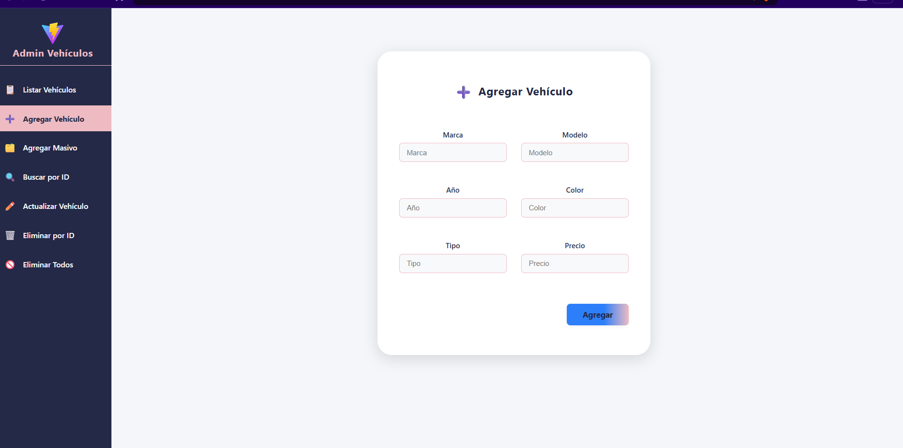
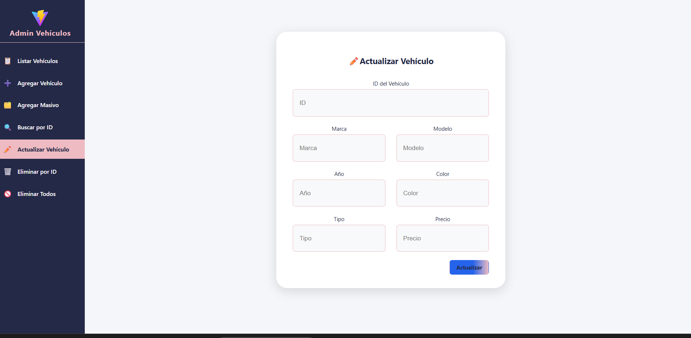
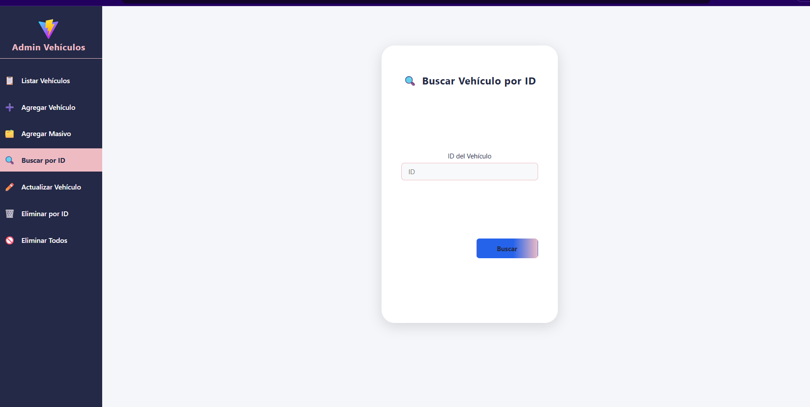
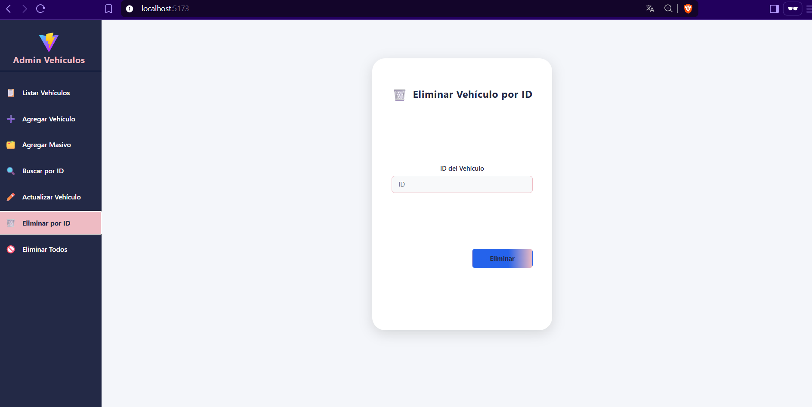
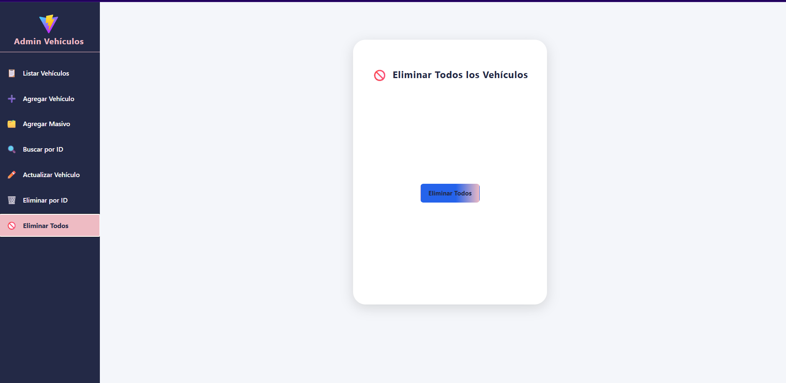
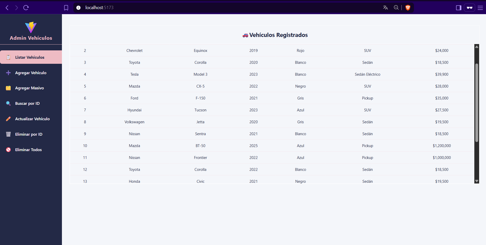
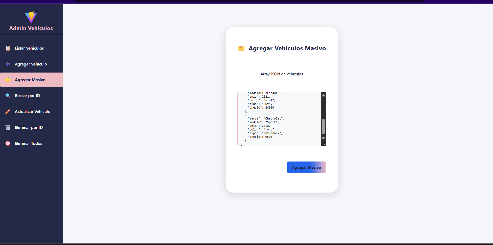

# Prueba de Endpoints de Vehículos

A continuación se muestran capturas de las pruebas realizadas a los endpoints principales de la API de vehículos:

- **Agregar Vehículo**
  

- **Actualizar Vehículo**
  

- **Buscar Vehículo**
  

- **Eliminar Vehículo por ID**
  

- **Eliminar Vehículo**
  

- **Listar Vehículos**
  

- **Agregar Vehículos Masivo**
  